# 第 11 章 数字证书综合使用 实验报告

## 实验一：使用私钥访问 SSH 服务器

### 环境设置

实验中的 SSH 客户端运行于 Windows 10

```
C:\Users\joshu>ssh -V
OpenSSH_for_Windows_8.1p1, LibreSSL 3.0.2
```

服务端运行于 WSL 2 (Ubuntu 20.04)

```
(base) lambda_x@Joshua-Laptop:/mnt/c/Users/joshu$ ssh -V
OpenSSH_8.2p1 Ubuntu-4ubuntu0.7, OpenSSL 1.1.1f  31 Mar 2020
```

### 实验步骤

1. 使用 OpenSSL 生成密钥对

   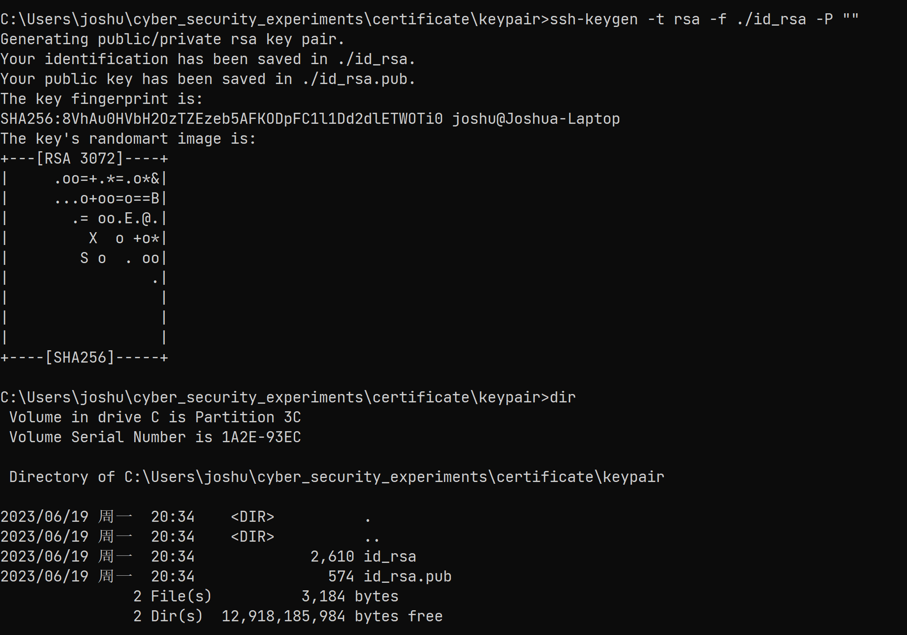

2. 复制公钥到服务器

   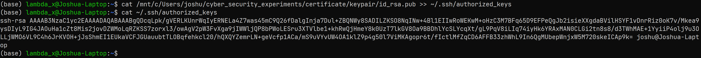

3. 开启 SSH 服务

   ```bash
   sudo service ssh start
   ```

   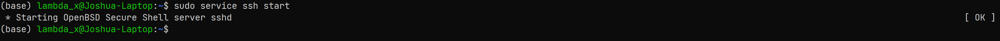

4. 关闭 SSH 密码登录

   ```bash
   sudo vim /etc/ssh/sshd_config
   ```

   设置 `PasswordAuthentication` 为 `no`

   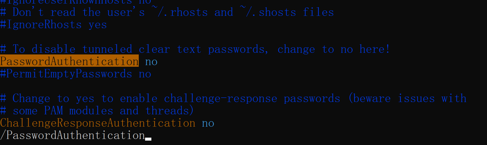

   接下来重启 SSH
   ```bash
   sudo service ssh restart
   ```
   
   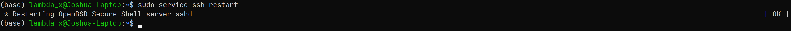


### 实验结果

1. 可以使用私钥访问该 SSH 服务器

   ```bash
   C:\Users\joshu\cyber_security_experiments\certificate\keypair>ssh -i id_rsa lambda_x@172.31.83.150
   ```

   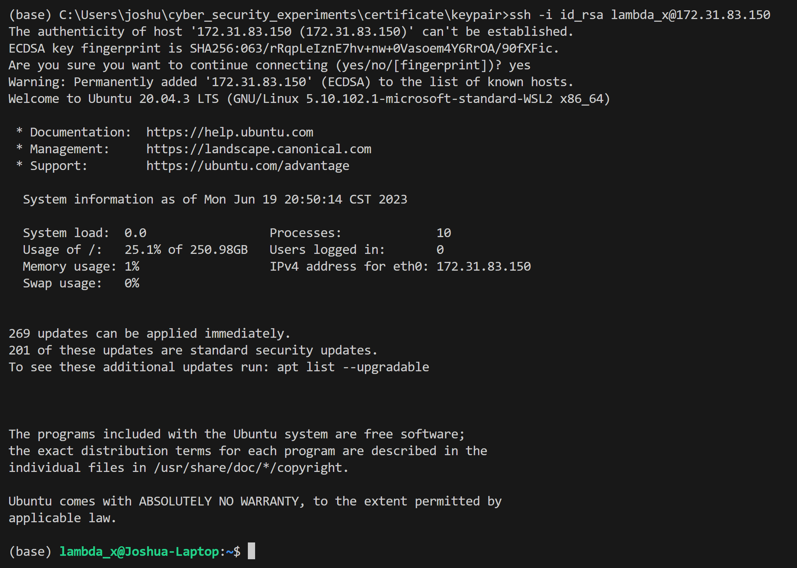

2. 关闭 SSH 密码登录功能后，不能通过密码登录

   ```bash
   C:\Users\joshu\cyber_security_experiments\certificate\keypair>ssh lambda_x@172.31.83.150
   ```

   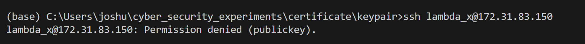

## 实验二：为网站添加 HTTPS

### 环境设置

```bash
$ nginx -V
nginx version: nginx/1.18.0 (Ubuntu)
built with OpenSSL 1.1.1f  31 Mar 2020
TLS SNI support enabled
...
$ lsb_release -a
...
Description:    Ubuntu 20.04 LTS
Release:        20.04
Codename:       focal
```

### 实验步骤及结果

1. 配置一个页面 `/srv/test-https-site/index.html`

   ```html
   <html>
       <head>
           <title>test page for https</title>
       </head>
       <body>
   		<h1>Hello, HTTPS</h1>
       </body>
   </html>
   ```

2. 配置 `Nginx` 代理

   ```nginx
   server {
           listen 80;
           server_name test-https.lmd.red;
           location / {
                   root /srv/test-https-site;
                   index index.html;
           }
   }
   ```

   接下来重启服务
   ```bash
   sudo systemctl restart nginx
   ```

3. 解析域名

   将 `test-https.lmd.red` 解析到配置好 Nginx 的服务器上

   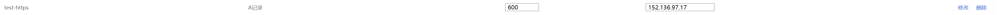

4. 使用 `acme.sh` 自助申请证书

   ```bash
   curl https://get.acme.sh | sh -s email=unknown@unknown.com
   sudo su -
   cd /home/ubuntu/.acme.sh
   ./acme.sh --register-account -m unknown@unknown.com
   ./acme.sh --issue -d test-https.lmd.red --nginx
   ```

   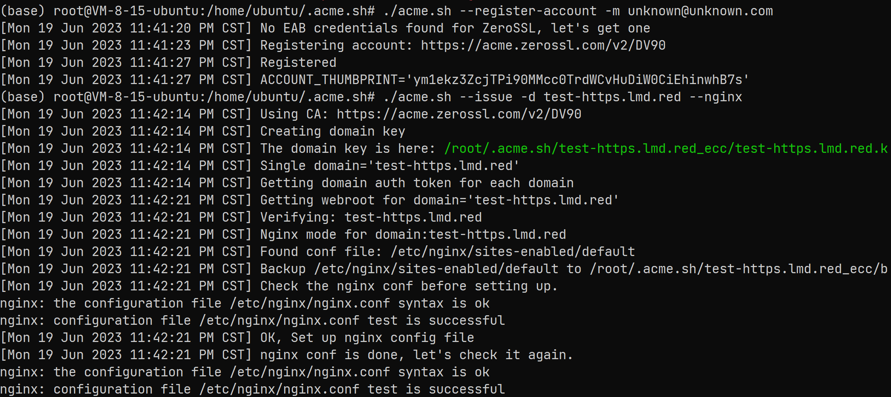

   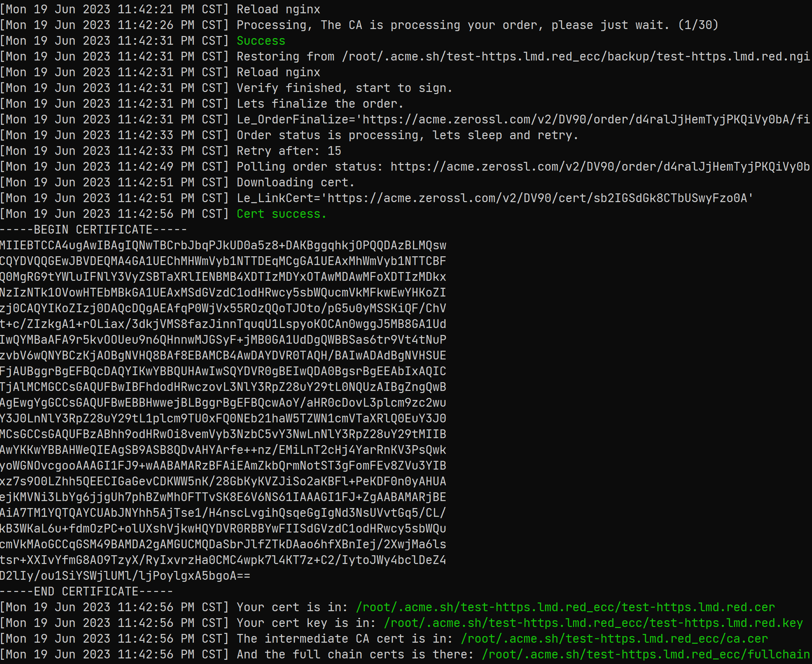

5. 安装证书

   将 Nginx 配置改为监听 443 端口，并将 80 端口上的请求重定向到 `https` 中。

   ```nginx
   server {
       listen 80;
       server_name test-https.lmd.red;
   
       location / {
           return 301 https://test-https.lmd.red$request_uri;
       }
   }
   
   server {
           listen 443 ssl http2;
           server_name test-https.lmd.red;
      		ssl_certificate /etc/cert/test-https-site/cert.pem;
   		ssl_certificate_key /etc/cert/test-https-site/key.pem;
           location / {
                   root /srv/test-https-site;
                   index index.html;
           }
   }
   ```

   继续执行

   ```bash
   mkdir -p /etc/cert/test-https-site
   ./acme.sh --install-cert -d test-https.lmd.red \
       --key-file       /etc/cert/test-https-site/key.pem  \
       --fullchain-file /etc/cert/test-https-site/cert.pem \
       --reloadcmd     "service nginx force-reload"
   ```

   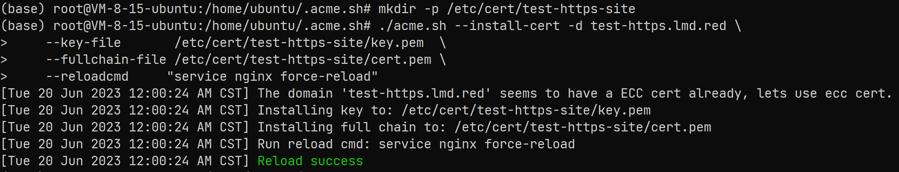

6. 此时访问 `https://test-https.lmd.red` 可观察到证书已经启用

   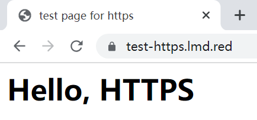

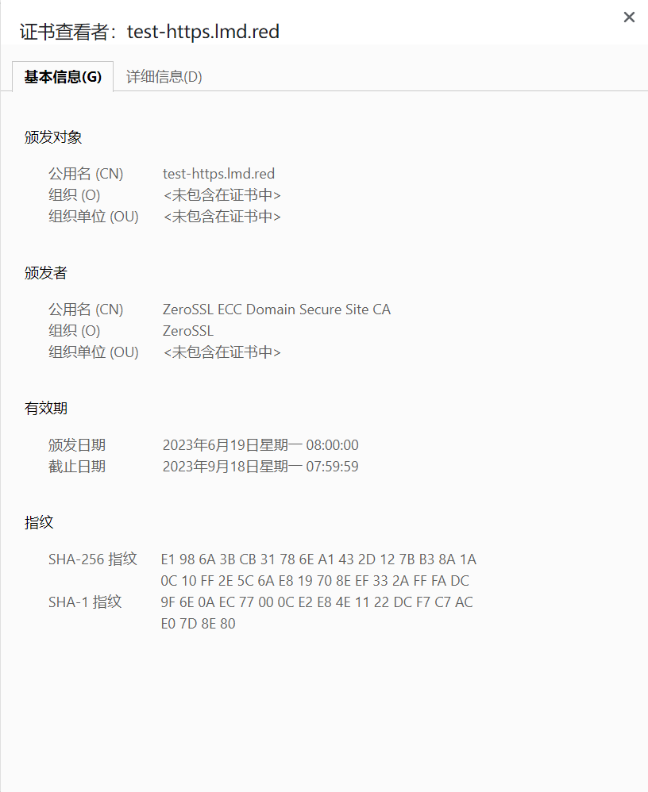