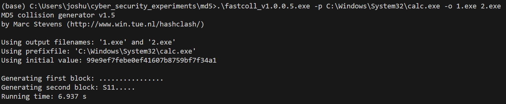
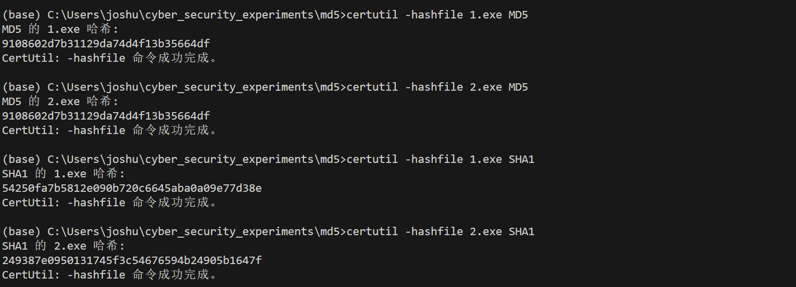

# 第 4 章 MD5散列值碰撞 实验报告

## 环境配置

```
>systeminfo
...
OS Name:     Microsoft Windows 10 家庭中文版
OS Version:  10.0.19045 N/A Build 19045
...
```

## 实验步骤及结果

首先使用 `fastcoll` 生产 md5 碰撞文件，接下来使用 `certutil` 验证文件 MD5 碰撞，并验证 SHA-1值不同。

```bash
.\fastcoll_v1.0.0.5.exe -p C:\Windows\System32\calc.exe -o 1.exe 2.exe
certutil -hashfile 1.exe MD5
certutil -hashfile 2.exe MD5
certutil -hashfile 1.exe SHA1
certutil -hashfile 2.exe SHA1
```





这说明 `1.exe` 和 `2.exe` 是两个具有相同 MD5 值的不同文件。