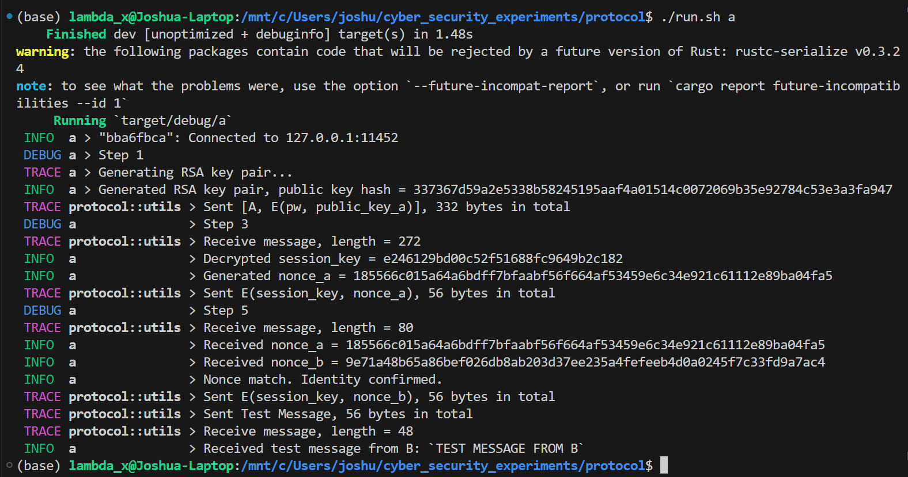
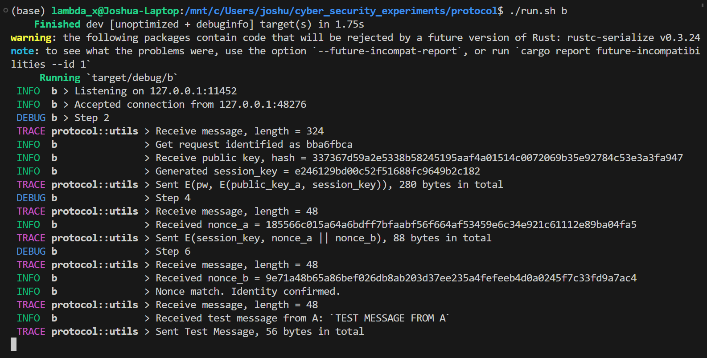

# 第 4 章 基于口令的身份验证协议

## 环境配置

```bash
$ lsb_release -a
No LSB modules are available.
Distributor ID: Ubuntu
Description:    Ubuntu 20.04.3 LTS
Release:        20.04
Codename:       focal
$ rustc -Vv
rustc 1.70.0-nightly (3a8a131e9 2023-04-02)
binary: rustc
commit-hash: 3a8a131e9509c478ece1c58fe0ea2d49463d2300
commit-date: 2023-04-02
host: x86_64-unknown-linux-gnu
release: 1.70.0-nightly
LLVM version: 16.0.0
$ cargo -Vv
cargo 1.70.0-nightly (0e474cfd7 2023-03-31)
release: 1.70.0-nightly
commit-hash: 0e474cfd7b16b018cf46e95da3f6a5b2f1f6a9e7
commit-date: 2023-03-31
host: x86_64-unknown-linux-gnu
libgit2: 1.5.0 (sys:0.16.0 vendored)
libcurl: 8.0.1-DEV (sys:0.4.61+curl-8.0.1 vendored ssl:OpenSSL/1.1.1q)
os: Ubuntu 20.04 (focal) [64-bit]
```

## 实验步骤

本实验中，使用 Rust 实现 Bellovin-Merritt 协议，完成基于口令的身份认证。

运行时，使用一个脚本来传入口令，通信地址等信息

```bash
export ADDR="127.0.0.1:11452"
export SECRET_PLAIN="hey! secret key!"
export SECRET=$(echo -n $SECRET_PLAIN | base64)
export RUST_LOG=trace

# run A if $1 == "A", run B if $1 == "B"
if [ x"$1" == x"a" ]; then
    cargo run --bin a
elif [ x"$1" == x"b" ]; then
    cargo run --bin b
else
    echo "Usage: $0 a|b"
fi

```

### 工具函数实现

- 常量和类型定义

  ```rust
  pub const BLOCK_LEN: usize = 16;
  pub const IDENT_LEN: usize = 4;
  pub const NONCE_LEN: usize = 32;
  
  pub type Block = [u8; BLOCK_LEN];
  pub type Key = [u8; BLOCK_LEN];
  pub type Identifier = [u8; IDENT_LEN];
  pub type Nonce = [u8; NONCE_LEN];
  
  pub const IV: Block = [0; BLOCK_LEN];
  ```

- 标识符/会话密钥/随机数生成

  ```rust
  pub fn get_identifier() -> Identifier {
      let mut rng = rand::thread_rng();
      let mut identifier = Identifier::default();
      rng.fill_bytes(&mut identifier);
      identifier
  }
  
  pub fn get_session_key() -> Key {
      let mut rng = rand::thread_rng();
      let mut key = Key::default();
      rng.fill_bytes(&mut key);
      key
  }
  
  pub fn get_nouce() -> Nonce {
      let mut rng = rand::thread_rng();
      let mut nonce = Nonce::default();
      rng.fill_bytes(&mut nonce);
      nonce
  }
  ```

- 环境变量中获取通信地址和口令

  ```rust
  pub fn get_env() -> (String, Key) {
      // get 'ADDR' and 'SECRET' from envrioment variables
      let addr = std::env::var("ADDR").expect("Failed to get ADDR from envrioment variables");
      let secret = env::var("SECRET").expect("Failed to get SECRET from envrioment variables");
  
      // base64 decode secret
      let mut secret = base64::decode(secret).expect("Failed to decode secret from base64");
  
      // pad secret to BLOCK_LEN
      secret.resize(BLOCK_LEN, 0);
  
      let key: Key = secret[..BLOCK_LEN]
          .try_into()
          .expect(&format!("Failed to convert {:?} to Key", &secret));
  
      (addr, key)
  }
  ```

- 对称加解密。本实验中的对称加密算法均采用 AES-128 + CBC 模式。第一个分块表示明文的长度。

  ```rust
  pub fn encrypt_aes(payload: &[u8], key: &[u8]) -> Vec<u8> {
      let mut encryption: Vec<u8> = Vec::new();
      let encrypter = Aes128::new(key.into());
  
      let data_length: [u8; 8] = (payload.len() as u64).to_be_bytes().try_into().unwrap();
      let mut data_length_block = Block::default();
      data_length_block[..8].clone_from_slice(&data_length);
      let mut blocks: Vec<u8> = Vec::new();
      blocks.extend(data_length_block);
      blocks.extend(payload);
  
      let blocks = blocks.chunks(BLOCK_LEN);
  
      // entrypt using CBC
      let mut prev_block = Vec::from(IV);
      for block in blocks {
          let mut block = block.to_vec();
          block.resize(BLOCK_LEN, 0);
          for i in 0..BLOCK_LEN {
              block[i] ^= prev_block[i];
          }
          encrypter.encrypt_block(GenericArray::from_mut_slice(&mut block));
          prev_block = block.clone();
          encryption.extend(block);
      }
  
      encryption
  }
  
  pub fn decrypt_aes(data: &[u8], key: &[u8]) -> Vec<u8> {
      let mut decryption: Vec<u8> = Vec::new();
      let decrypter = Aes128::new(key.into());
  
      assert!(
          data.len() % BLOCK_LEN == 0,
          "data length {} is not a multiple of {}",
          data.len(),
          BLOCK_LEN
      );
      let blocks = data.chunks(BLOCK_LEN);
  
      // decrypt using CBC
      let mut prev_block = Vec::from(IV);
      for block in blocks {
          let mut dec_block = block.to_vec();
          decrypter.decrypt_block(GenericArray::from_mut_slice(&mut dec_block));
          for i in 0..BLOCK_LEN {
              dec_block[i] ^= prev_block[i];
          }
          prev_block = Vec::from(block);
          decryption.extend(dec_block);
      }
  
      // remove padding
      let data_length = usize::from_be_bytes(decryption[..8].try_into().unwrap());
      decryption.drain(..BLOCK_LEN);
      decryption.truncate(data_length);
      decryption
  }
  ```

- 公钥加解密。本实验的公钥密码算法采用 RSA-2048。

  ```rust
  pub fn encrypt_rsa(data: &[u8], key: &RsaPublicKey) -> Vec<u8> {
      let mut rng = rand::thread_rng();
      key.encrypt(&mut rng, Pkcs1v15Encrypt, data).unwrap()
  }
  
  pub fn decrypt_rsa(data: &[u8], key: &RsaPrivateKey) -> Vec<u8> {
      key.decrypt(Pkcs1v15Encrypt, data).unwrap()
  }
  ```

- TCP 消息收发。在消息头部添加 8 字节表示消息长度。发送消息时以 `trace` 等级记录消息长度和内容。

  ```rust
  pub fn send_message(stream: &mut std::net::TcpStream, data: &[u8], desc: Option<&str>) {
      let msg_len = data.len();
      let mut msg_with_len = Vec::new();
      msg_with_len.extend(msg_len.to_be_bytes());
      msg_with_len.extend(data);
      match stream.write(&msg_with_len) {
          Ok(n) => {
              if let Some(desc) = desc {
                  trace!("Sent {}, {} bytes in total", desc, n);
              } else {
                  trace!("Sent {} bytes in total", n);
              }
          }
          Err(e) => panic!("Failed to send {:?} to B: {:?}", &msg_with_len, e),
      }
  }
  
  pub fn read_message(stream: &mut TcpStream) -> Result<Vec<u8>> {
      let mut length_buffer = [0; 8];
      stream.read_exact(&mut length_buffer)?;
      let length = usize::from_be_bytes(length_buffer);
      trace!("Receive message, length = {}", length);
      let mut buffer = vec![0; length];
      stream.read_exact(&mut buffer)?;
      Ok(buffer)
  }
  ```

### 协议实现

下面详细描述协议的实现过程。

- 步骤 1：A 每次开始与 B 认证时，随机生成一段新公私钥对（实验中选为 RSA-2048），接着向 B 发送自己的标识及用共享口令加密的的公钥。`a.rs` 中关键实现代码如下

  ```rust
  /* Step 1 */
  debug!("Step 1");
  
  // A -> B: [A, E(pw, public_key_a)]
  trace!("Generating RSA key pair...");
  let private_key_a = RsaPrivateKey::new(&mut rand::thread_rng(), 2048).unwrap();
  let public_key_a = RsaPublicKey::from(&private_key_a);
  let public_key_a_der = public_key_a.to_public_key_der().unwrap();
  let public_key_a_bytes = public_key_a_der.as_bytes();
  info!("Generated RSA key pair, public key hash = {}", {
      let mut hasher = Sha256::new();
      hasher.update(public_key_a_bytes);
      hex::encode(hasher.finalize())
  });
  let encrypted_public_key_a = encrypt_aes(&public_key_a_bytes, &secret);
  let msg = [Vec::from(ident), encrypted_public_key_a].concat();
  send_message(&mut stream, &msg, Some("[A, E(pw, public_key_a)]"));
  ```

- 步骤 2：B 收到密文后，使用口令进行解密，得到 A 的公钥。接下来 B 生成会话密钥，用 A 的公钥加密后，再用口令加密。`b.rs` 中关键实现代码如下

  ```rust
  /* Step 2 */
  debug!("Step 2");
  
  // A -> B: [A, E_pw(public_key_a)]
  let msg = read_message(stream).expect("Failed to read message from A");
  let (ident, encrypted_public_key_a) = msg.split_at(mem::size_of::<Identifier>());
  info!("Get request identified as {}", hex::encode(&ident));
  
  // parse public key from A
  let public_key_a_bytes = decrypt_aes(&encrypted_public_key_a, secret);
  info!("Receive public key, hash = {}", {
      let mut hasher = Sha256::new();
      hasher.update(&public_key_a_bytes);
      hex::encode(hasher.finalize())
  });
  let public_key_a = RsaPublicKey::from_public_key_der(&public_key_a_bytes)
      .expect("Failed to parse public key bytes");
  
  // B -> A: E(pw, E(pka, session_key))
  let session_key = get_session_key();
  info!("Generated session_key = {}", hex::encode(&session_key));
  let rsa_encrypted_session_key = encrypt_rsa(&session_key, &public_key_a);
  let symmetric_encrypted_session_key = encrypt_aes(&rsa_encrypted_session_key, secret);
  send_message(
      stream,
      &symmetric_encrypted_session_key,
      Some("E(pw, E(pka, session_key))"),
  );
  ```

- 步骤 3：A 获得两重加密的密文后使用口令和私钥依次解密得到会话密钥。接下来 A 使用会话密钥加密随机数 `nonce_a` 发送给 B。`a.rs` 中关键实现代码如下

  ```rust
  /* Step 3 */
  debug!("Step 3");
  
  // B -> A: E(pw, E(pka, session_key))
  let symmetric_encrypted_session_key = read_message(&mut stream)
      .expect("Failed to read E(pw, E(public_key_a, session_key)) from B");
  let rsa_encrypted_session_key = decrypt_aes(&symmetric_encrypted_session_key, &secret);
  let session_key = decrypt_rsa(&rsa_encrypted_session_key, &private_key_a);
  let session_key: Key = session_key
      .as_slice()
      .try_into()
      .expect("Failed to convert session_key to Key");
  info!("Decrypted session_key = {}", hex::encode(&session_key));
  
  // A -> B: E(session_key, nonce_a)
  let nonce_a = get_nouce();
  info!("Generated nonce_a = {}", hex::encode(&nonce_a));
  send_message(
      &mut stream,
      &encrypt_aes(&nonce_a, &session_key),
      Some("E(session_key, nonce_a)"),
  );
  ```

- 步骤 4：B 使用会话密钥解密得到 `nonce_a`，将其与另一随机数 `nonce_b` 拼接后，使用会话密钥加密，再发给 A。`b.rs` 中的关键代码如下

  ```rust
  /* Step 4 */
  debug!("Step 4");
  
  // A -> B: E(session_key, nonce_a)
  let nonce_a = decrypt_aes(
      &read_message(stream).expect("Failed to read E(session_key, nonce_a) from A"),
      &session_key,
  );
  info!("Received nonce_a = {}", hex::encode(&nonce_a));
  
  // B -> A: E(session_key, nonce_a || nonce_b)
  let nonce_b = get_nouce();
  let encrypted_nonce_a_cat_nonce_b =
      encrypt_aes(&[nonce_a, Vec::from(nonce_b)].concat(), &session_key);
  send_message(
      stream,
      &encrypted_nonce_a_cat_nonce_b,
      Some("E(session_key, nonce_a || nonce_b)"),
  );
  ```

- 步骤 5：A 使用会话密钥解密消息，检查收到的 `nonce_a` 与发送时是否一致。一致，则确定 B 的身份。接下来 A 将解密得到的 `nonce_b` 使用会话密钥加密后发送给 B。`a.rs` 中关键实现代码如下

  ```rust
  /* Step 5 */
  debug!("Step 5");
  
  // B -> A: E(session_key, nonce_a || nonce_b)
  let nonce_a_cat_nonce_b = decrypt_aes(
      &read_message(&mut stream)
          .expect("Failed to read E(session_key, nonce_a || nonce_b) from B"),
      &session_key,
  );
  let (nonce_a_recv, nonce_b) = nonce_a_cat_nonce_b.split_at(mem::size_of::<Nonce>());
  info!("Received nonce_a = {}", hex::encode(&nonce_a_recv),);
  info!("Received nonce_b = {}", hex::encode(&nonce_b));
  
  // Check nonce_a_recv
  if nonce_a != nonce_a_recv {
      error!(
          "Nouce mismatch: nonce_a != nonce_a_recv, i.e. {} != {}",
          hex::encode(&nonce_a),
          hex::encode(&nonce_a_recv)
      );
      std::process::exit(1);
  } else {
      info!("Nonce match. Identity confirmed.");
  }
  
  // A -> B: E(session_key, nonce_b)
  send_message(
      &mut stream,
      &encrypt_aes(&nonce_b, &session_key),
      Some("E(session_key, nonce_b)"),
  );
  ```

- 步骤 6：B 使用会话密钥解密消息，检查收到的 `nonce_b` 与发送时是否一致。一致，则确认 A 的身份，认证结束。`b.rs` 中的关键代码如下

  ```rust
  /* Step 6 */
  debug!("Step 6");
  
  // A -> B: E(session_key, nonce_b)
  let nonce_b_recv = decrypt_aes(
      &read_message(stream).expect("Failed to read E(session_key, nonce_b) from A"),
      &session_key,
  );
  let nonce_b_recv = nonce_b_recv.as_slice();
  info!("Received nonce_b = {}", hex::encode(&nonce_b_recv));
  
  
  // Check nonce_b_recv
  if nonce_b != nonce_b_recv {
      error!(
          "Nouce mismatch: nonce_b != nonce_b_recv, i.e. {} != {}",
          hex::encode(&nonce_b),
          hex::encode(&nonce_b_recv)
      );
      return None;
  } else {
      info!("Nonce match. Identity confirmed.");
  }
  
  // convert to Identifier and Key
  let ident: Identifier = ident
      .try_into()
      .expect("Failed to convert ident to Identifier");
  let session_key: Key = session_key
      .try_into()
      .expect("Failed to convert session_key to Key");
  ```

### A 与 B 通信

对于 A ，其首先获得标识符、通信地址、口令，接下来建立 TCP 连接，和 B 根据身份验证协议进行交互。确认身份后，A 返回自己的标识符，会话密钥和所用的 TCP 流。最后，使用得到的会话密钥和 B 进行加密通信。

```rust
fn establish_conn() -> (Identifier, Key, TcpStream) {
    pretty_env_logger::init();
    let (addr, secret) = get_env();
    let ident = get_identifier();

    let mut stream =
        TcpStream::connect(&addr).expect(format!("Failed to connect to {}", &addr).as_str());
    info!("{:?}: Connected to {}", hex::encode(&ident), addr);
    
    ...
    
    (ident, session_key, stream)
}

fn main() {
    let (_, session_key, mut stream) = establish_conn();

    let message = "TEST MESSAGE FROM A";
    send_message(
        &mut stream,
        &encrypt_aes(message.as_bytes(), &session_key),
        Some("Test Message"),
    );

    let test_messsage_from_b = decrypt_aes(
        &read_message(&mut stream).expect("Failed to read test message from B"),
        &session_key,
    );
    info!(
        "Received test message from B: `{}`",
        String::from_utf8(test_messsage_from_b).unwrap()
    );
}

```

而对于 B，其在获得的地址和端口上进行监听，对于得到的请求依据协议进行身份确认。若身份确认成功，则利用得到的会话密钥进行加密通信。

```rust
fn main() {
    pretty_env_logger::init();
    let (addr, secret) = get_env();
    let listener = TcpListener::bind(&addr).expect(format!("Failed to bind to {}", &addr).as_str());
    info!("Listening on {}", addr);

    loop {
        let (mut stream, _) = listener.accept().expect("Failed to accept connection");
        info!("Accepted connection from {:?}", stream.peer_addr().unwrap());

        match handle_requeststream(&mut stream, &secret) {
            Some((_, session_key)) => {
                info!("Identity confirmed!");

                let test_messsage_from_a =
                    read_message(&mut stream).expect("Failed to read test message from A");
                let test_messsage_from_a = decrypt_aes(&test_messsage_from_a, &session_key);
                info!(
                    "Received test message from A: `{}`",
                    String::from_utf8(test_messsage_from_a).unwrap()
                );

                let message = "TEST MESSAGE FROM B";
                let encrypted_message = encrypt_aes(message.as_bytes(), &session_key);
                send_message(&mut stream, &encrypted_message, Some("Test Message"));
            }
            None => {
                error!(
                    "Fail to establish connection from {:?}",
                    stream.peer_addr().unwrap()
                );
            }
        }
    }
}
```

总之，A 与 B 先依据协议实现协商会话密钥。最后 A 和 B 使用会话密钥进行对称式加密通信。具体来说，A 发送一条测试消息给 B，然后 B 发送一条测试消息给 A。

## 实验结果





如图中 log 所示，A 和 B 可以完成协议各步骤的通信内容，完成身份认证，并使用协商得到的会话密钥进行过对称式加密通信。
