# 第 13 章 常见Web漏洞演示 

## 环境配置

```
Python 3.8.8 (default, Apr 13 2021, 15:08:03) [MSC v.1916 64 bit (AMD64)] :: Anaconda, Inc. on win32
flask==2.3.2
```

基于提供的 `flask` 应用，演示两类 XSS 攻击，SQL 注入攻击和 CSRF 攻击，并演示基本的防御方法。

为了便于演示，我们使用一个环境变量 `UNSAFE` 来控制是否开启基础安全措施。若 `UNSAFE` 为 `True`，则关闭基础安全措施，否则开启。

对于主站设其域名为 `main.test`，对于 CSRF 攻击页面设其域名为 `csrf.test` 来模拟跨域的情况。在 `hosts` 文件中添加如下内容

```
127.0.0.1   main.test
127.0.0.1   csrf.test
```

使用如下命令运行 Chrome 浏览器，禁用跨域安全检查，以便于演示 CSRF 攻击

```
"C:\Program Files (x86)\Google\Chrome\Application\chrome.exe" --args --disable-web-security --incognito
```

## XSS 攻击

### 反射型 XSS 攻击

我们提交如下搜索查询

```html
<script> alert("reflective!"); </script>
```

在搜索结果页面中看到了弹窗。此时诱导用户点击这一查询结果链接，即可触发恶意脚本执行。

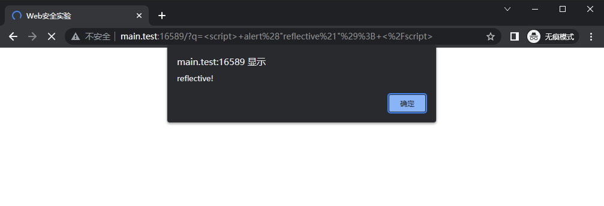

### 持久型 XSS 攻击

我们在评论中提交如下内容

```html
<script> alert("persistent!"); </script>
```

在评论被加载时看到了弹窗。此时由于这些代码已经被写入了数据库中，所有用户在查看评论时都会触发恶意脚本执行。

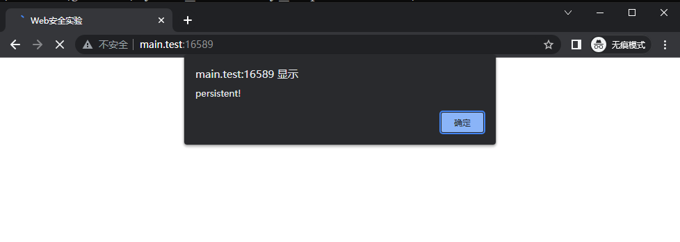

### 防御措施

为了防御 XSS 攻击，我们将用户的查询和评论在渲染前使用 `escape` 函数进行转义，关键代码如下

```python
from markupsafe import escape
...
# Default
@app.route('/', methods=['GET', 'POST'])
def index():
    ...
    if not UNSAFE: # XSS escape
        if search_query is not None:
            search_query = escape(search_query)
        comments = [
            [escape(comment), escape(username) if username is not None else None] 
            for comment, username in comments
        ]

    res =  render_template('index.html',
                           comments=comments,
                           search_query=search_query,
                           user=user,
                           token=token,
                           message=message)
    ...
```
置 `UNSAFE=0` 后，此前的攻击序列将被转义

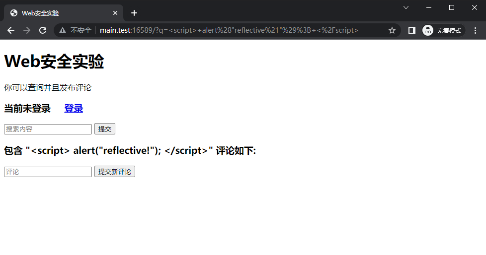

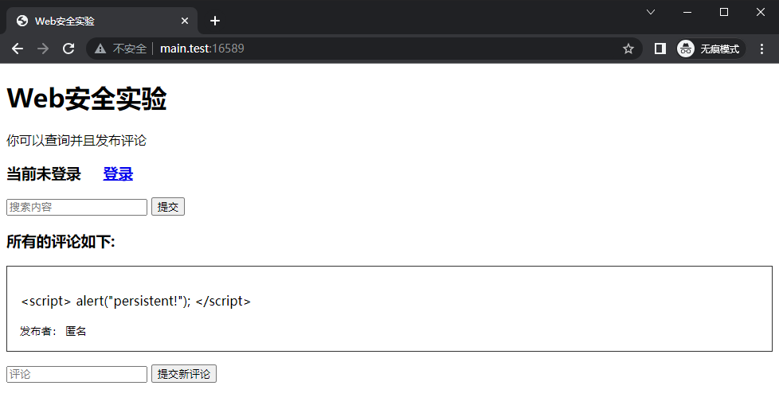

## SQL 注入攻击

我们在 `add_comment` 函数中引入一个在 `UNSAFE` 情形下会导致 SQL 注入的漏洞，寄在执行添加内容的查询时，将字符串拼接嵌入而不是使用参数化查询。

```python
# Add A Comment
def add_comment(comment, request) -> bool:
    ...
    if UNSAFE:
        if username is None:
            db.cursor().executescript(
    	        f"INSERT INTO comments (username, comment) VALUES (NULL, '{comment}')"
            )
        else:
            db.cursor().executescript(
                f"INSERT INTO comments (username, comment) VALUES ('{username}', '{comment}')"
            )
    else:
        db.cursor().execute('INSERT INTO comments (username, comment) VALUES (?, ?)', (username, comment))
    ...
```

接下来我们添加如下评论内容

```
whatever'); update comments set comment='HACKED!'; --
```

这导致数据库中的评论内容被修改为 `HACKED!`。

实验中，我们先添加一些评论

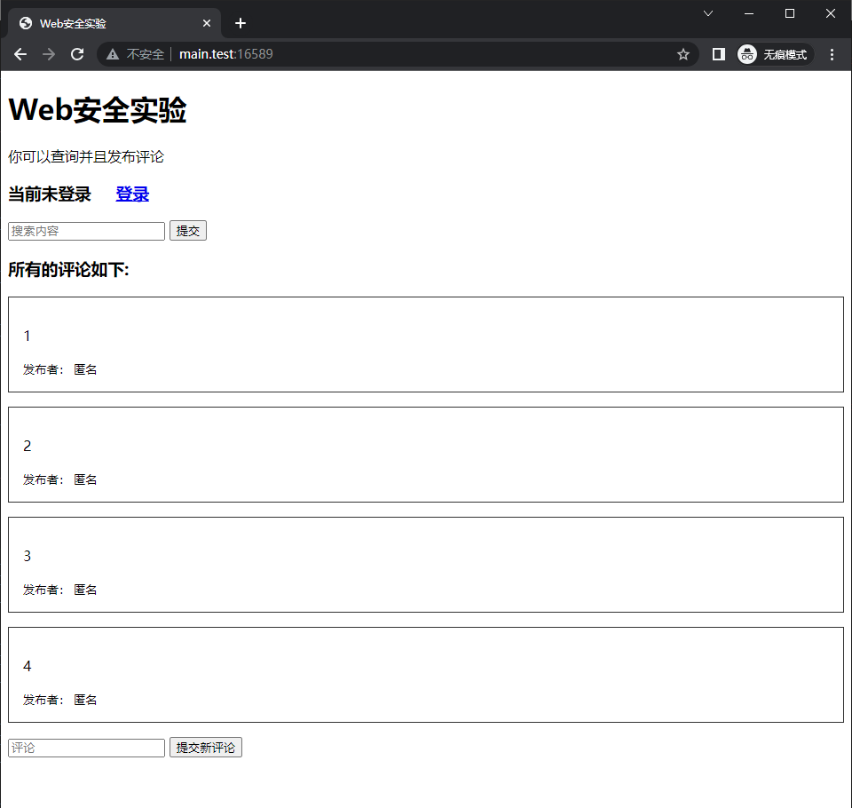

接下来添加 `whatever'); update comments set comment='HACKED!'; --`，效果如下


### 防御措施

为了防御 SQL 注入攻击，应当参数化查询，而不是将字符串拼接嵌入查询中，如上述代码在 `UNSAFE` 为 `False` 时所做的那样。此时非法输入将被转义，因而不会被执行。

我们置 `UNSAFE=0`，再次评论 `whatever'); update comments set comment='HACKED!'; --`，结果如下

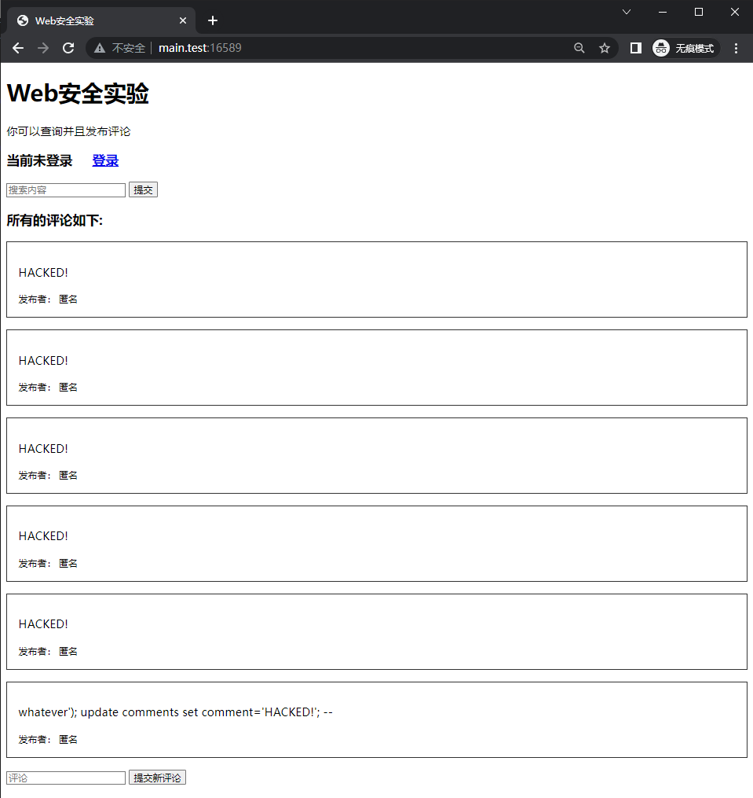

此时输入中的 `'` 被转义并未影响 SQL 语句的正常执行。

## CSRF 攻击

为了演示 CSRF 攻击，我们首先给网站添加一个登录功能。对于登录用户，发表的评论将会显示其用户名，对于未登录用户，显示 `匿名`。同时，我们设置一个默认用户 `lambda`，默认密码 `11452`。

对于登录用户，我们在 Cookie 中设置 `session` 来表示身份。关键代码如下

```python
# Add A Comment
def add_comment(comment, request) -> bool:
    db = connect_db()

    # check session
    session_id = request.cookies.get('session')
    csrf_token = request.form.get('csrf_token')
    print(session_id)
    if session_id is None:
        user_token = None
    else:
        user_token = db.cursor().execute('SELECT username, csrf_token FROM sessions WHERE session_id=?', (session_id,)).fetchone()
    match = False
    
    username = None
    if user_token is not None:
        username, token = user_token
        if token == csrf_token:
            match = True

    if not UNSAFE:
        if username is not None and not match:
            print('CSRF Token Error')
            return True

    if UNSAFE:
        ... # Demo for SQL Injection
    else:
        db.cursor().execute('INSERT INTO comments (username, comment) VALUES (?, ?)', (username, comment))
    db.commit()
    return False

# Login
@app.route('/login', methods=['POST'])
def login():
    username = request.form.get('username')
    password = request.form.get('password')
    
    db = connect_db()
    user = db.cursor().execute('SELECT username FROM users WHERE username=? AND password=?', (username, password)).fetchone()

    res = redirect(url_for('index'))
    if user is not None:
        # create session
        session_id = os.urandom(16).hex()
        csrf_token = os.urandom(16).hex()
        db.cursor().execute('INSERT INTO sessions (username, session_id, csrf_token) VALUES (?, ?, ?)', (username, session_id, csrf_token))
        db.commit()

        res.set_cookie('session', session_id)
        res.set_cookie('message', 'Login Success!')
    else:
        res.set_cookie('message', 'Login Failed!')
    return res
                                        
# Logout
@app.route('/logout', methods=['POST', 'GET'])
def logout():
    res = redirect(url_for('index'))

    # delete session
    session_id = request.cookies.get('session')
    db = connect_db()
    db.cursor().execute('DELETE FROM sessions WHERE session_id=?', (session_id,))
    db.commit()

    res.set_cookie('session', '', expires=0)
    return res

@app.route('/login', methods=['GET'])
def login_page():
    return render_template('login.html')
```

现在用户可以通过 `/login` 登录，并发表署名评论。

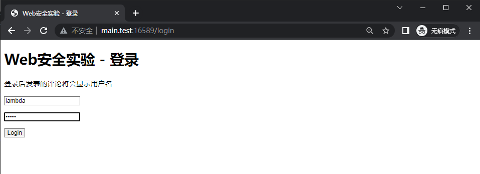

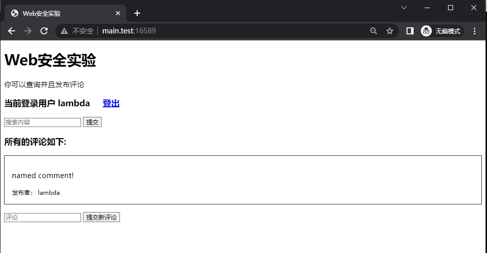

我们的 CSRF 攻击页面 `csrf.html` 构造如下

```html
<!DOCTYPE html>

<html>
  <head>
    <meta charset="utf-8">
    <title>CSRF Demo</title>
    <script>
      // add time into comment on page load
      window.onload = function() {
        var comment = document.getElementsByName("comment")[0];
        var now = new Date();
        comment.value += " (" + now.toLocaleString() + ")";
      }

    </script>
  </head>

  <body>
    <form action="http://main.test:16589" method="POST">
      <input type="hidden" name="comment" value="[CSRF] illegal comment" />
      <input type="submit" value="Refresh" />
    </form>
  </body>
</html>

```

该页面在用户点击 `Refresh` 按钮时，会利用已登录用户的 Cookie 向网站发出一个 POST 请求，从而完成一个伪造的署名评论。

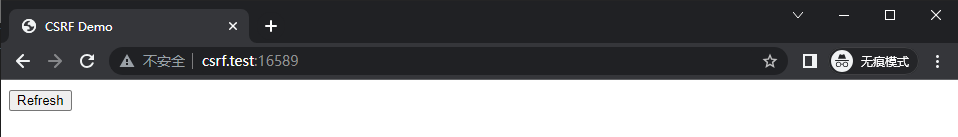

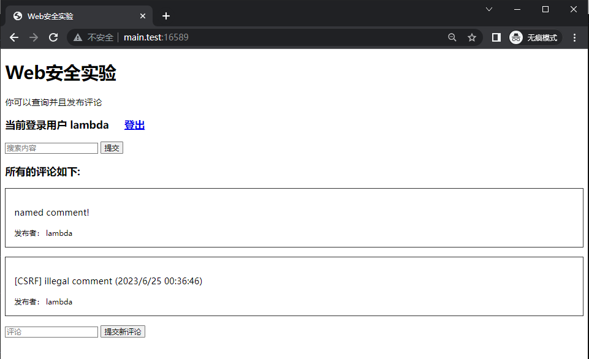

### 防御措施

为了防御 CSRF 攻击，我们在用户登录时，为其会话随机生成一个 `csrf_token` 存储于数据库中。在用户发表评论时，我们检查其 `csrf_token` 是否与数据库中的一致，若不一致，则拒绝其请求，并向用户显示 `CSRF Token Mismatch`。判断 CSRF Token 是否一致的代码已经在 `add_comment` 函数中给出

用户正常提交表单时，将 CSRF Token 嵌入

```html
<form action="/" method="POST">
  <input type="text" name="comment" 
         placeholder="评论" autocomplete="off" />
  
    <input type="hidden" name="csrf_token" value="{{ token }}" />
  
  <input type="submit" value="提交新评论" />
</form>
```

显示警告的代码如下：

```python
# Default
@app.route('/', methods=['GET', 'POST'])
def index():
    ...
    # Site Index
    csrf_warning = False
    if request.method == 'POST':
        comment = request.form['comment']
        if comment:
            csrf_warning = add_comment(comment, request)
    ...

    if csrf_warning:
        if message is None:
            message = 'CSRF Token Mismatch!'
        else:
            message += '<br />CSRF Token Mismatch!'
    ...
```

我们启动后再次进入 `csrf.test:16589` ，点击 `Refresh` 按钮，此时由于无法得到正确的 CSRF token，我们无法成功添加署名评论。此时 `CSRF Token Mismatch!` 提示我们应用发现 CSRF token 不正确。

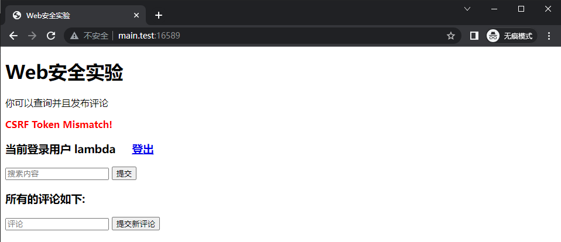

---

详细的实验代码见 `app.py` ，`templates/*.html` 。

